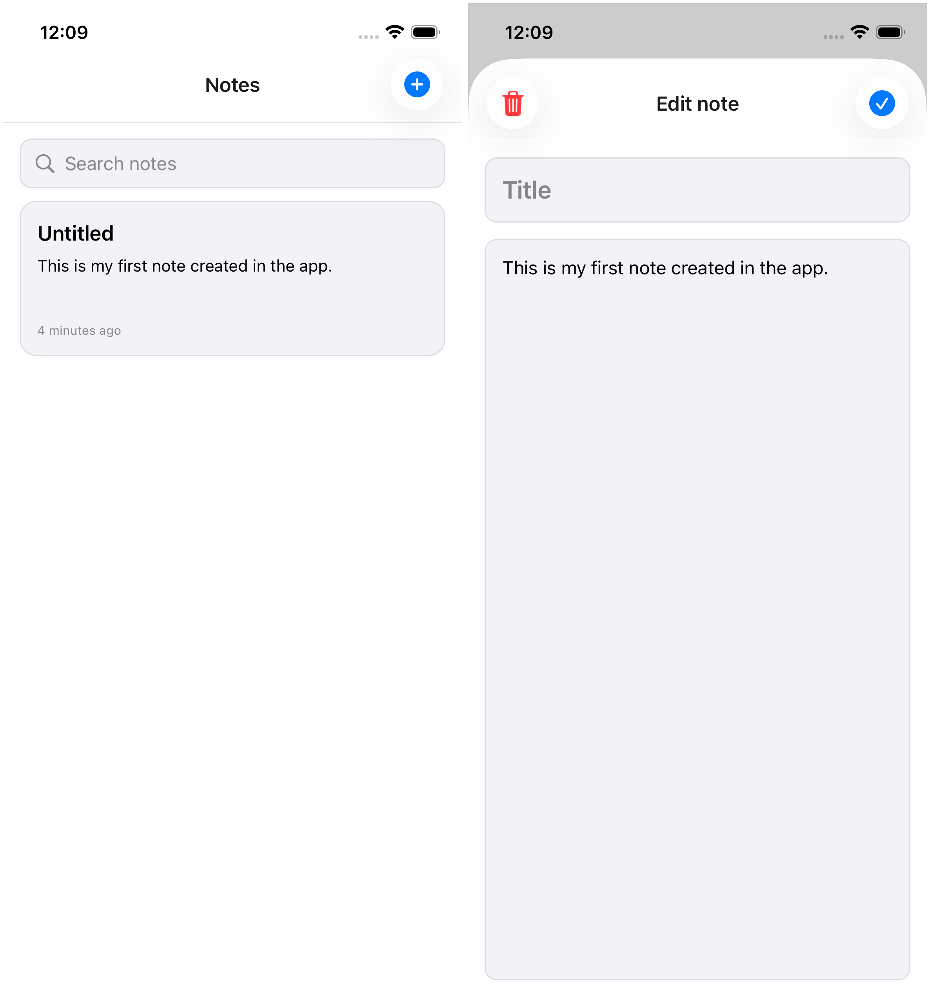

# Drizzle + Expo SQLite (Modernized)

A notes app rebuilt on Expo SDK 55 with modern router, styling, and local data patterns.

## Demo

https://github.com/user-attachments/assets/deaf0af6-aba7-4ba3-af69-a8e7d8909bb2

<picture>
  <source media="(prefers-color-scheme: dark) and (max-width: 767px)" srcset="./media/readme/screenshot-dark-mobile.png">
  <source media="(prefers-color-scheme: dark) and (min-width: 768px)" srcset="./media/readme/screenshot-dark-desktop.png">
  <source media="(prefers-color-scheme: light) and (max-width: 767px)" srcset="./media/readme/screenshot-light-mobile.png">
  <source media="(prefers-color-scheme: light) and (min-width: 768px)" srcset="./media/readme/screenshot-light-desktop.png">
  
</picture>

## Stack

- Expo SDK 55
- React Native 0.83 / React 19.2
- Expo Router (`src/app` layout)
- Drizzle ORM v1 beta + Expo SQLite
- NativeWind v5 preview + Tailwind CSS v4 + react-native-css
- tailwind-variants
- TanStack Form

## Key architecture choices

- `src/app` route-first app structure
- URL-backed search state (`/?q=...`)
- Platform icon strategy via `expo-symbols` mappings (SF Symbols iOS + Material symbols Android/Web)
- Drizzle migrations run at app startup via `drizzle-orm/expo-sqlite/migrator`

## Run locally

```bash
pnpm install
pnpm start
pnpm ios
pnpm android
pnpm check
```

## Generate migrations

```bash
pnpm generate
```
